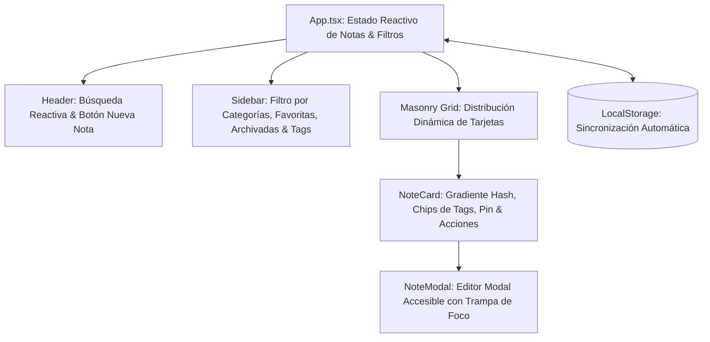

# NoteFlow — Workspace de Notas & Productividad Personal

<div align="center">


**Workspace de productividad personal para captura ágil, organización visual y etiquetado multifacetado de notas en formato Masonry dinámico con gradientes algorítmicos y persistencia local.**

[🚀 Demo en Vivo](https://alxnrocha.github.io/app-notas/) • [📂 Repositorio en GitHub](https://github.com/alxnrocha/app-notas)

</div>

---

## 🏛️ Arquitectura y Flujo de Componentes



---

## ✨ Características Principales

- **Layout Dinámico Masonry:** Disposición automática de tarjetas según longitud de contenido con efectos de iluminación ambiental y glassmorphism.
- **Búsqueda Reactiva & Filtrado por Etiquetas:** Filtrado en tiempo real por texto normalizado, estado (`Activas`, `Archivadas`), favoritos y tags (`#tags`).
- **Gestión Completa de Notas (CRUD):** Creación modal, edición directa, fijado de favoritas, archivado y eliminación con confirmación.
- **Gradientes Hash Automatizados:** Generación determinista de paletas cromáticas por categoría para facilitar la identificación visual rápida.
- **Persistencia en LocalStorage:** Sincronización automática de estado en el navegador sin dependencias de backend.

---

## 🗂️ Estructura del Proyecto

```text
06-app-notas/
├── index.html
├── src/
│   ├── components/                # NoteCard, NoteModal, FilterSidebar, SearchBar
│   ├── types/                     # Tipos e interfaces TypeScript
│   ├── App.tsx                    # Componente raíz con hooks de estado
│   └── main.tsx                   # Entrada principal React 19
├── package.json
├── tsconfig.json
└── vite.config.ts
```

---

## 🚀 Instalación y Puesta en Marcha

### Prerrequisitos
- Node.js `>= 20.0.0`
- npm `>= 10.0.0`

### Ejecución Local
```bash
# 1. Clonar el repositorio
git clone https://github.com/alxnrocha/app-notas.git
cd app-notas

# 2. Instalar dependencias
npm install

# 3. Iniciar servidor de desarrollo
npm run dev

# 4. Compilar para producción
npm run build
```

---

## 🛠️ Tecnologías Utilizadas

| Capa | Tecnología | Aspectos Clave |
|---|---|---|
| **Framework** | React 19 | Hooks modernos, renderizado condicional optimizado |
| **Lenguaje** | TypeScript 5.8 | Tipado estricto para entidades de nota, tags y estados |
| **Estilos** | Tailwind CSS v4 | Glassmorphism, grid dinámico tipo Masonry |
| **Bundler** | Vite 6.0 | Compilación ultrarrápida y optimización para web |
| **Despliegue** | GitHub Pages | Despliegue estático continuo y optimizado |

---

<div align="center">
  <sub>Desarrollado con dedicación por <a href="https://github.com/alxnrocha">Alex Rocha</a> • Proyecto 06 del Portafolio Profesional Frontend.</sub>
</div>
