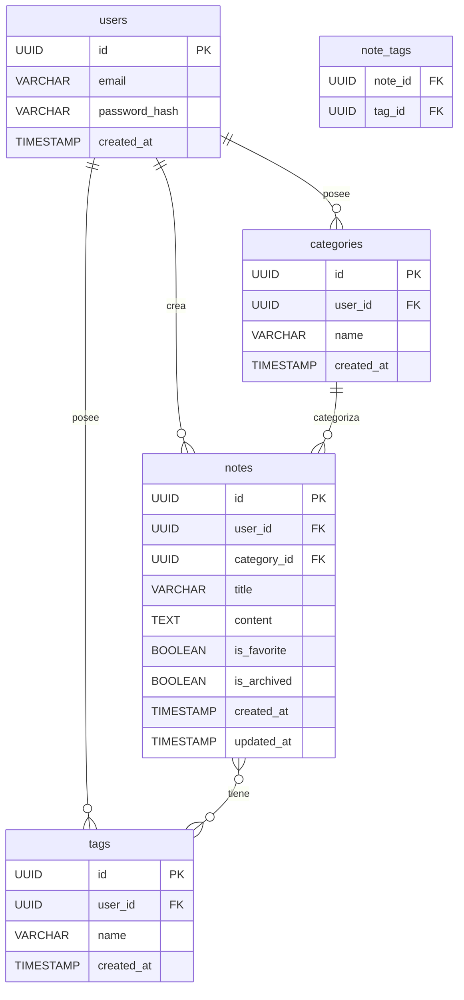

# Modelado de Base de Datos - App de Notas

Este directorio contiene la documentación teórica de cómo la estructura de datos se modelaría en un entorno real con base de datos relacional (PostgreSQL), para demostrar capacidad de arquitectura de datos más allá del `localStorage` usado en el MVP frontend.

## Archivos

- `schema.sql`: Estructura de tablas, relaciones (Foreign Keys) e índices.
- `seed.sql`: Datos de semilla de prueba (Usuarios, notas, categorías, etiquetas).

## Diagrama Entidad-Relación (DER)

A continuación, la representación visual del diagrama DER.

## Decisiones de diseño

1. **Relación M:N para Etiquetas**: Se usa una tabla pivote `note_tags` para permitir que una nota tenga múltiples etiquetas y una etiqueta agrupe múltiples notas.
2. **Escalabilidad Multi-tenant**: Se añadió la tabla `users` para demostrar que el modelo está preparado para escalar como un producto real multi-usuario (SaaS), aislando los datos mediante `user_id`.
3. **Integridad Referencial**: Uso intensivo de `ON DELETE CASCADE` para limpiar datos huérfanos si un usuario o nota se elimina.
